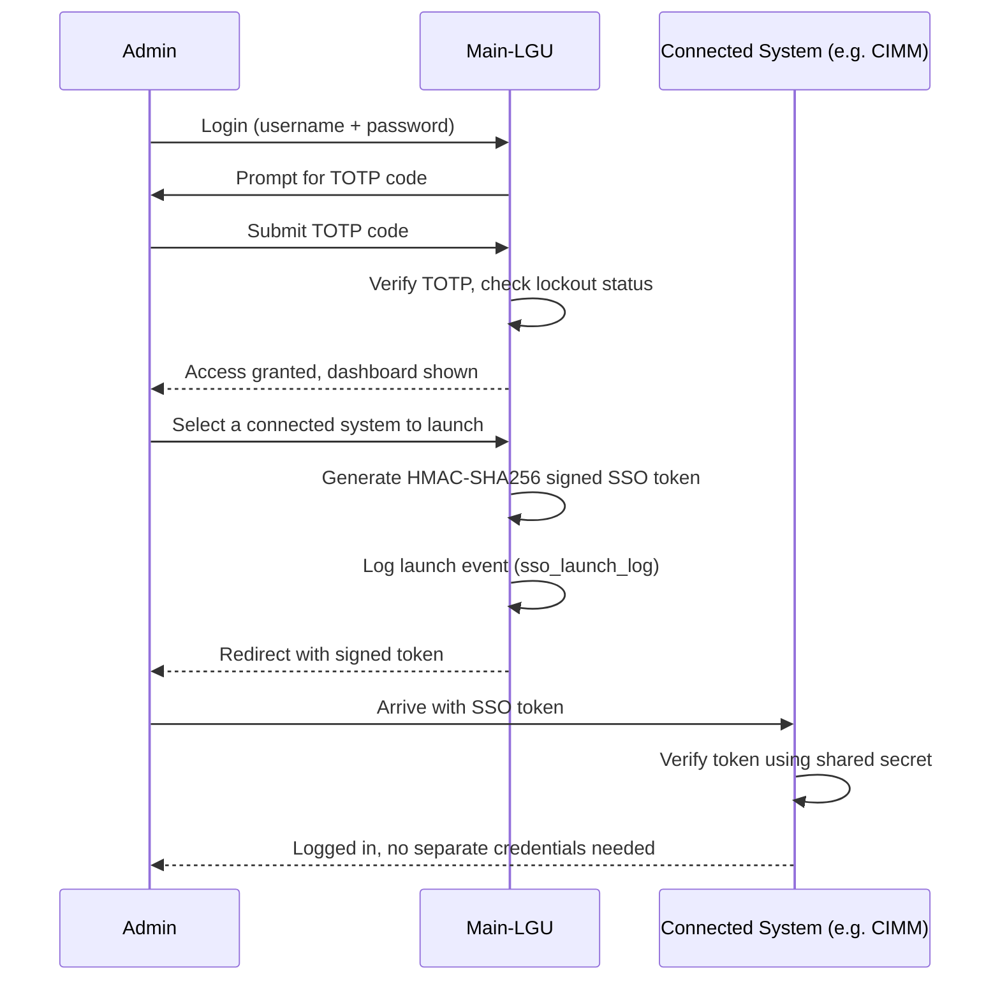

# Main-LGU

Central SSO hub and system launcher for a Local Government Unit's digital services suite. Main-LGU does not handle citizen services itself — instead, it authenticates staff and administrators once, then securely launches them into whichever connected system they need, while keeping a full audit trail of who accessed what and when.

> Status: School capstone / prototype project.

---

## Overview

Local government offices often end up running several separate digital systems — one for road monitoring, one for infrastructure programs, one for facility records, and so on — each with its own login. Main-LGU solves that by acting as a single, secured front door: super-admins authenticate once (with TOTP two-factor authentication), and Main-LGU issues short-lived, cryptographically signed tokens that let them jump straight into any connected system without logging in again.

It also gives leadership a birds-eye view: a citizen-facing dashboard with live community stats, and an internal analytics/audit panel showing system usage, security events, and team activity across the whole suite.

---

## Connected Systems

Main-LGU is built to manage seven connected systems, each registered with its own base URL and signed independently using a dedicated shared secret:

| System | Name | Role |
|---|---|---|
| ROADMON | Road Monitoring (RGMAP) | Overseeing road construction, maintenance, and city transportation networks |
| IPMS | IPMS | Planning and oversight of city-wide construction and development projects |
| ENERGY | Energy | Implementing sustainable energy practices and city-wide conservation programs |
| CPRF | Facilities Reservation | Booking community centers, parks, and sports fields for public use |
| CIMM | CIMM | Coordinating repairs and upkeep for public assets and safety systems |
| URBAN PLANNING | Urban Planning & Development (UPAD) | Zoning, architectural reviews, and long-term city growth strategies |
| UMAN | Utilities Management System | Managing water, electricity, and waste disposal consumer accounts and service requests |

All seven are live, independently deployed systems on their own domains; Main-LGU is the shared authentication and launch layer that sits in front of them.

---

## Key Features

- **Single sign-on launcher** — one login for admins, secure token-based access into any connected system
- **Super-admin authentication** — TOTP-based two-factor login with backup recovery codes and automatic account lockout after failed attempts
- **Multi-admin support** — more than one super-admin account, each independently auditable
- **System registry** — connected systems are managed centrally (base URL, display name, status) rather than hardcoded
- **Full audit trail** — every login, launch, and administrative action is logged (`system_audit_log`, `sso_launch_log`)
- **Security monitoring** — a dedicated security panel surfaces alerts (e.g. repeated failed logins, suspicious activity)
- **Citizen-facing dashboard** — public community statistics pulled live via AJAX, no login required
- **Team management** — manage staff/admin accounts from a single panel
- **Usage analytics** — a dashboard summarizing activity across all connected systems

---

## How It Works

### Admin login and launch flow

Each connected system verifies the token using the same shared secret configured on both sides (`SSO_SECRET_ROADMON`, `SSO_SECRET_IPMS`, etc.), so a token minted by Main-LGU can only be redeemed by the system it was issued for.

### Security safeguards

- Failed login attempts count toward an account lockout window (`locked_until`)
- TOTP secrets can be rotated, with the rotation timestamp tracked (`secret_rotated_at`)
- Lost-device recovery is handled through one-time backup codes (`super_admin_recovery_codes`)
- Every administrative action — system changes, launches, security events — writes to an append-only audit log

---

## Tech Stack

`PHP` `MySQL` `PHPMailer`

---

## Data Model (Highlights)

- `super_admins` / `super_admin_recovery_codes` — admin accounts and TOTP backup codes
- `connected_systems` — the registry of systems Main-LGU can launch into, with display and status metadata
- `sso_launch_log` — a record of every SSO launch (who, which system, when)
- `system_audit_log` — general administrative audit trail

---

## Related Projects

- [LGU](https://github.com/EXEQUIELKENT/LGU) — the CIMM system: a citizen infrastructure-reporting and repair-coordination module that plugs into Main-LGU as one of its connected systems.

---

## Author

Built by [Exequiel Kent T. Bartolome](https://github.com/EXEQUIELKENT).
